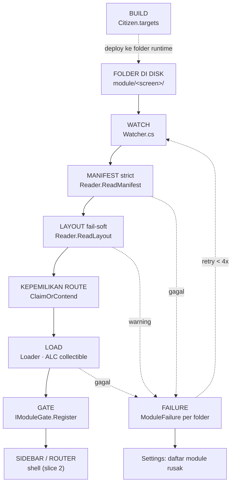

# CITADEL-FLOWS-CROSS — flow lintas module

Dokumen ini tumbuh per slice. Setiap flow ditulis sebagai node-per-pekerjaan
dengan pemilik file, diagram ASCII (terbaca di editor mana pun) dan mermaid
(untuk viewer), plus bukti `file:baris`. Pelanggaran batas tidak dijelaskan di
sini — ia dicatat di `CITADEL-VIOLATIONS.md` dan hanya dirujuk.

Isi saat ini:

1. [Pencarian & pemuatan module](#1-pencarian--pemuatan-module) — SELESAI
2. [Shell, registrasi, navigasi, dan lapisan penegak batas](#2-shell-registrasi-navigasi-dan-lapisan-penegak-batas) — SELESAI
3. Composition shared UI — BELUM (slice 3)
4. PyHost bridge — BELUM (slice 4)
5. Tests & release — BELUM (slice 8)

---

## 1. Pencarian & pemuatan module

**Status: terdokumentasi 2026-09-11 dari kode, bukan dari plan.**

Ini flow yang paling dekat dengan konsep kernel yuz-ui, dan temuan utamanya
berlawanan dengan dugaan awal: **alur registrasi module sudah benar-benar
"parent mendengarkan, child mendaftar lewat kehadiran folder"**. Core tidak
pernah mencari, tidak pernah melihat path folder, tidak pernah tahu module
berasal dari disk. Yang menyimpang adalah hal lain (lihat rujukan pelanggaran
di akhir bagian ini).

### 1.1 Node dan pemiliknya

| Node | Pekerjaan (satu) | Pemilik |
| --- | --- | --- |
| MANIFEST | membaca + memvalidasi `module.json` (identitas) | `module/Citadel.Searcher/Reader.cs` |
| LAYOUT | membaca + memvalidasi `layout.json` (presentasi, fail-soft) | `module/Citadel.Searcher/Reader.cs` |
| WATCH | memantau folder runtime, debounce, retry, kepemilikan route | `module/Citadel.Searcher/Watcher.cs` |
| LOAD | memuat entry assembly ke ALC collectible + instantiate `IModule` | `module/Citadel.Searcher/Loader.cs` |
| FAILURE | menyatakan bagian mana yang gagal, per folder | `module/Citadel.Searcher/ModuleFailure.cs` |
| GATE | permukaan tempat core **mendengarkan** registrasi | `core/Citadel.Contract/IModuleGate.cs` |
| DESCRIPTOR | segala yang shell perlu tahu tentang satu screen, tanpa asal-usul | `core/Citadel.Contract/ModuleDescriptor.cs` |
| BUILD | referensi, deployment, dan pemeriksaan isolasi citizen | `module/Citizen.targets` |

Satu-satunya wajah publik searcher adalah `Watcher`; `Reader`, `Loader`, dan
`ModuleManifest` semuanya `internal` (`Watcher.cs:28`, `Reader.cs:20`,
`Loader.cs:38`, `ModuleManifest.cs:11`).

### 1.2 Flow ASCII

```text
FOLDER DI DISK  (AppContext.BaseDirectory/module/<nama-screen>/)
│  module.json · layout.json · <Entry>.dll · .deps.json · dependensi privat
▼
[WATCH]  Watcher.cs — FileSystemWatcher + pump bersignal
│      event apa pun → petakan ke folder induk (FolderOf) → debounce 250 ms
│      reset budget retry tiap event baru (Watcher.cs:283)
│      tidak ada polling: pump tidur InfiniteTimeSpan saat idle (Watcher.cs:391)
▼
[MANIFEST]  Reader.ReadManifest — STRICT
│      wajib: title · route · entry · type     opsional: icon · order
│      route harus well-formed (Reader.cs:217) dan tidak reserved (Reader.cs:91)
│      entry tidak boleh keluar dari folder screen (Reader.cs:178)
│      gagal → folder gagal, tidak ada assembly dimuat
▼
[LAYOUT]  Reader.ReadLayout — FAIL-SOFT
│      tidak ada file       → null, normal, screen tetap terdaftar
│      ada tapi tak terpakai → null + warning; screen TETAP terdaftar
│      slot tanpa "kind" ditolak di sini, sekali, di tempat file dibaca
▼
[KEPEMILIKAN ROUTE]  Watcher.ClaimOrContend
│      route sudah milik folder lain → jadi contender, tapi tetap diajukan ke
│      gate supaya gate yang menolak (satu pemilik kebijakan duplikat)
│      kepemilikan TIDAK dicatat, agar menghapus yang kalah tidak
│      unregister yang menang (Watcher.cs:516-520)
▼
[LOAD]  Loader.Load — satu ALC collectible per screen
│      assembly dibaca sebagai BYTE lalu LoadFromStream, bukan LoadFromAssemblyPath
│      → handle file tidak ditahan → folder tetap bisa dihapus saat app hidup
│      resolver dibangun dari path SEBELUM load (stream-load tak punya Location)
│      assembly Citadel.* bersama → hook mengembalikan null → default context
│      → IModule tetap SATU identitas tipe di seluruh app
│      validasi berurutan: file ada → tipe ada → tipe IModule → konstruksi
│                         → Route modul == route manifest
▼
[GATE]  IModuleGate.Register(ModuleDescriptor)
│      core mendengarkan; ia tidak pernah mencari (IModuleGate.cs:3-5)
│      void, dan itu keputusan bukan kelalaian (IModuleGate.cs:7-12)
│      marshal ke main thread di dalam gate, karena watcher naik dari
│      threadpool dan EventStream.Fire sinkron di thread pemanggil
▼
SIDEBAR / ROUTER  (shell — slice 2)
```

### 1.3 Versi mermaid



### 1.4 State yang dimiliki WATCH (tidak dibagi dengan siapa pun)

| State | Isi | Kenapa di sini |
| --- | --- | --- |
| `_pending` | folder → kapan jatuh tempo | satu operasi pending per folder; event baru menunda, bukan menambah pass |
| `_routeByFolder` | folder → route yang dimiliki | dasar "hapus folder = unregister route" |
| `_folderByRoute` | route → folder pemilik | dasar deteksi route diperebutkan |
| `_contenders` | route → folder yang menunggu | menghapus pemilik mempromosikan penunggu |
| `_failures` | folder → masalah saat ini | direkonsiliasi, bukan ditumpuk |
| `_attempts` | folder → jumlah percobaan | budget retry, reset pada event baru |

Semua di bawah satu `_state` lock (`Watcher.cs:50-56`).

### 1.5 Satu jalur reconcile (keputusan yang dikunci kode)

Initial scan, setiap event watcher, tombol `Update modules`, pemulihan
`FileSystemWatcher.Error`, dan retry semuanya bermuara ke
`Watcher.ReconcileFolder` (`Watcher.cs:10-13`, `122-126`, `271-273`,
`426-460`, `467`). Konsekuensi yang terlihat pemilik:

- **Serialized, bukan sekadar debounce.** Satu pump memproses satu folder pada
  satu waktu; dua folder yang mendeklarasikan route sama tidak bisa dua-duanya
  menang, apa pun interleaving-nya di disk (`Watcher.cs:15-18`).
- **DLL yang berubah tidak di-reload.** Folder yang sudah terdaftar dengan
  route yang sama berhenti di `AlreadyRegistered` (`Watcher.cs:505`, `619-626`).
  Inilah tempat sebenarnya dari perilaku "DLL baru terpakai setelah restart".
  Alasannya tercatat: reload akan register dua kali, gate melaporkan duplikat
  terhadap folder yang merupakan satu-satunya pengklaim, dan tiap pass menahan
  satu load context lagi.
- **Pump tidak boleh mati.** Exception apa pun di satu pass hanya dilog
  (`Watcher.cs:370-375`) — ini fault isolation tingkat discovery.
- **Folder gagal tetap di-unregister dulu** sebelum retry: screen yang DLL-nya
  hilang tidak boleh tetap ditawarkan (`Watcher.cs:702-704`).

### 1.6 Fault isolation dan anggaran retry

| Kondisi | Perilaku | Bukti |
| --- | --- | --- |
| Root module tak ada | dibuat; install bersih memang tanpa citizen | `Watcher.cs:174-191` |
| Root tak bisa dipakai/dipantau | failure `SearchStage.Root`, tombol Update jadi fallback, tanpa polling pengganti | `Watcher.cs:184-189`, `229-235` |
| `module.json` rusak | folder gagal; **strict** | `Reader.cs:44-115` |
| `layout.json` rusak | warning; screen **tetap terdaftar** | `Reader.cs:123-171`, `Watcher.cs:507-514` |
| Entry/tipe/konstruksi/route gagal | failure dengan stage tepat + pesan penyebab | `Loader.cs:74-127` |
| Citizen mengirim salinan `Citadel.Contract` sendiri | pesan khusus yang menyebut penyebab dan perbaikan | `Loader.cs:278-287` |
| Folder setengah tersalin | retry 4× backoff 400 ms × attempt | `Watcher.cs:34-40`, `693-715` |
| Route diperebutkan | failure **terminal**, bukan transient (tidak bisa sembuh dengan menunggu) | `Watcher.cs:537-549` |
| Pemilik route dihapus | contender dipromosikan lewat jalur reconcile yang sama | `Watcher.cs:666-682` |
| Exit | context di-unload sekali di sini, tidak pernah saat folder dihapus | `Loader.cs:143-169` |
| Pump macet (network path mati) | `Dispose` menunggu maksimal 2 detik lalu lanjut | `Watcher.cs:147-159` |

### 1.7 Kontrak build citizen (`module/Citizen.targets`)

Inilah yang membuat "tambah screen = tambah folder" benar secara struktural,
bukan secara niat:

- Citizen **tidak masuk `Citadel.slnx`** dan dibangun langsung
  (`Module.Blank.csproj:9-11`), jadi tidak ada satu pun file di luar `module/`
  yang berubah saat screen bertambah.
- Nama assembly **diturunkan dari nama folder** (`Citizen.targets:48-50`).
  Alasannya tercatat dan terukur: WPF membakar URI resource
  `/Module.Blank;component/blankview.xaml` dan meresolusinya lewat lookup
  process-wide ber-key *simple assembly name* lintas semua load context, jadi
  dua folder citizen dengan nama assembly sama berebut satu key dan yang kalah
  melempar "does not have a resource identified by the URI" dari view-nya
  sendiri (`Citizen.targets:32-47`).
- Deployment target = **output Shell**, bukan output proyek, karena itulah
  folder yang dipantau searcher (`Citizen.targets:14-16`, `85-86`).
- Payload yang di-deploy persis yang dibutuhkan loader: entry DLL + PDB +
  `.deps.json` + `module.json` + `layout.json` + dependensi privat non-Citadel
  (`Citizen.targets:113-130`).
- `Private="false"` untuk tiga assembly bersama (`Citizen.targets:74-77`) dan
  **`VerifyCitizenIsolation` menegakkannya saat build** terhadap folder
  ter-deploy, bukan output build, karena folder ter-deploy yang dibaca loader
  (`Citizen.targets:142-151`).
- `EnableDynamicLoading=true` wajib: tanpa itu tidak ada `.deps.json` dan setiap
  dependensi privat gagal resolve diam-diam (`Citizen.targets:52-59`).
- Payload python `sharedLogic` di-deploy sebagai **sibling** `module\`, bukan di
  dalamnya, karena searcher hanya memantau `module\` dan `Build-Release.ps1`
  menghitung `module\*` terhadap proyek citizen (`Citizen.targets:87-94`,
  `167-185`).
- Plugin pyhost milik citizen hidup di
  `<citizen>\Features\<Feature>\<paket_python>\` dan di-deploy **flat** ke
  `sharedLogic\pyhost\<paket>\`; `plugin.py` ikut di-deploy sebagai `__init__.py`
  sehingga mengimpor paket menjalankan registrasi (`Citizen.targets:186-214`).
  Catatan penting untuk slice 4: **ini mekanisme self-registration versi python**
  dan ia diaktifkan lewat `CITADEL_PYHOST_PLUGINS`.

### 1.8 Template citizen (`module/blank`)

Enam file, dan itulah seluruh isi sebuah screen:

| File | Pekerjaan |
| --- | --- |
| `Module.Blank.csproj` | import `Citizen.targets`, deklarasikan apa pun tidak |
| `module.json` | identitas: title, route, order, entry, type |
| `layout.json` | slot yang bisa diedit user (contoh: `Message` kind `visibility`) |
| `BlankModule.cs` | satu-satunya wajah ke shell: `Route` + `CreateView(Lifetime)` |
| `BlankView.xaml(.cs)` | isi screen |

`Route` di kelas wajib sama dengan `route` di manifest, dan searcher yang
memeriksa (`BlankModule.cs:8-10`, `Loader.cs:117-127`) — kalau tidak, entri
sidebar dan router tidak setuju dan navigasi mendarat di tempat kosong.
Lifetime **dipinjamkan, bukan dimiliki**: segala yang dimulai view didaftarkan
di sana, dan berpindah halaman menghancurkannya (`BlankModule.cs:11-13`,
`IModule.cs:16-17`).

### 1.9 Tepi dependensi flow ini

```text
Citadel.Searcher ──▶ Citadel.Contract ──▶ Citadel.Core
        (dideklarasikan)      (dideklarasikan)   ← bocor ke citizen secara transitif
citizen ──▶ Citadel.Core, Citadel.Contract, Citadel.Setting   (Private=false)
citizen ──✗ Citadel.Shell, Citadel.Ui                          (dilarang)
Citadel.Searcher ──▶ InternalsVisibleTo Citadel.Uia
```

Bentuk yang dimaksud: searcher hanya mendeklarasikan Contract
(`Citadel.Searcher.csproj:13-15`). Kenyataannya Contract sendiri menarik Core
(`Citadel.Contract.csproj:16`), sehingga tipe Core *reachable* di searcher dan
di setiap citizen. Aturan "jangan pakai" di sini berbentuk **komentar**, bukan
penegakan compiler (`Citadel.Searcher.csproj:7-11`, `Watcher.cs:23-27`).
→ `CITADEL-VIOLATIONS.md` D6 (dan C3: tidak ada penegak mesin di tingkat ini).

### 1.10 Yang sudah cocok dengan konsep kernel yuz-ui

| Konsep yuz-ui | Padanan citadel di flow ini | Bukti |
| --- | --- | --- |
| Parent mendengarkan, tidak mencari | `IModuleGate` adalah permukaan core saat menunggu | `IModuleGate.cs:3-5` |
| Child mendaftar lewat kehadiran folder | folder + `module.json` = citizen; tanpa manifest = bukan citizen, bukan citizen rusak | `Reader.cs:37-38`, `Watcher.cs:477-485` |
| Tambah/hapus plugin = tambah/hapus folder, nol edit core | citizen di luar `.slnx`, deploy ke output Shell | `Module.Blank.csproj:9-11`, `Citizen.targets:14-16` |
| Kontrak tipis sebagai satu-satunya permukaan | `ModuleDescriptor` menyembunyikan asal-usul; `ModuleManifest` internal di searcher | `ModuleDescriptor.cs:3-8`, `ModuleManifest.cs:4-6` |
| Fault isolation tidak mematikan kernel | exception satu pass hanya dilog; folder gagal di-retry; root rusak tidak menjatuhkan startup | `Watcher.cs:370-375`, `693-715`, `174-191` |
| Satu pemilik kebijakan | gate yang menolak route duplikat, bukan searcher | `Watcher.cs:516-520` |
| Satu jalur, bukan dua perilaku | semua pemicu → `ReconcileFolder` | `Watcher.cs:10-13` |

### 1.11 Rujukan register dari slice ini

- **D6** — `Citadel.Contract` bergantung pada `Citadel.Core`; batas "Contract
  only" ditegakkan dengan komentar. Disahkan hook, jadi ini ketegangan desain,
  bukan pelanggaran graf.
- **A1** — jumlah tipe kontrak publik diklaim empat di dua dokumen, kenyataannya
  lima.
- **D7** — definisi "assembly Citadel bersama" ditulis tiga kali dengan tiga
  mekanisme dan tiga isi berbeda.
- **D1** — `module/` memegang empat peran: citizen, infrastruktur discovery,
  payload bersama, dan vault kredensial 499 MB.
- **C1/C2** — tepi `Compile Include` dan baseline referensi citizen tidak
  terlihat oleh hook graf dependensi.

Detail, bukti baris, dan bentuk lurusnya: `CITADEL-VIOLATIONS.md`.

---

## 2. Shell, registrasi, navigasi, dan lapisan penegak batas

**Status: terdokumentasi 2026-09-11 dari kode.** Bagian ini menutup empat flow
inventory sekaligus: katalog & registrasi module ke shell, shell lifecycle &
composition root, layout/navigasi antar tab, dan sebagian runtime inti.

Temuan utamanya: **graf dependensi citadel dikunci oleh mesin dan saat ini nol
pelanggaran.** Keluhan "agent tetap membuat saling import" karenanya bukan
berada di lapisan ini — ia berada di dalam satu citizen, antar feature, dan itu
tidak dijaga gate apa pun (§2.8).

### 2.1 Node dan pemiliknya

| Node | Pekerjaan (satu) | Pemilik |
| --- | --- | --- |
| ENTRY | titik masuk proses, single-instance | `core/Citadel.Shell/Program.cs`, `SingleInstanceHost.cs` |
| COMPOSITION ROOT | satu-satunya tempat yang boleh tahu kedua sisi | `core/Citadel.Shell/App.xaml.cs` |
| MAIN QUEUE | antrean main-thread tanpa Dispatcher di Core | `core/Citadel.Core/crl/MainQueue.cs` |
| WATCHDOG | pengawas loop | `core/Citadel.Core/crl/Watchdog.cs` |
| TOKENS | tema + override layout, persisted | `core/Citadel.Core/tokens/` |
| GATE | registri module: terima, tolak, urutkan | `core/Citadel.Shell/ModuleGate.cs` |
| BUILT-IN ROUTES | route milik shell yang tak pernah lewat discovery | `core/Citadel.Shell/BuiltInRoute.cs`, `App.xaml.cs:177-188` |
| ROUTER | route → view, dan pemilik lifetime view yang tampil | `core/Citadel.Shell/Router.cs` |
| LAYOUT APPLIER | menerapkan slot layout dari luar view | `core/Citadel.Shell/LayoutApplier.cs` |
| SETTING HOST | jembatan shell → layar setting | `core/Citadel.Shell/ShellSettingHost.cs`, `setting/ISettingHost.cs` |
| RESIDENT | tray-resident, show/hide, close-vs-exit | `core/Citadel.Shell/ResidentShell.cs`, `TrayHost.cs` |
| SIDEBAR | render entri navigasi + pengelompokan | `core/Citadel.Ui/Controls/Sidebar.cs`, `core/Citadel.Shell/SidebarGroupingStore.cs` |
| UPDATE | periksa & terapkan update app | `core/Citadel.Shell/AppUpdateController.cs`, `AppUpdateService.cs` |

### 2.2 Urutan startup (bukan kosmetik, alasannya tercatat)

```text
Program.cs  →  single instance  →  App.OnStartup
                                     │
   Log.Start()                       │  (1) logging hidup lebih dulu
   MainQueue(wake: Dispatcher.BeginInvoke, isMain: Dispatcher.CheckAccess)
   Crl.Initialize(main)              │  (2) Core tidak pernah melihat Dispatcher
   Crl.StartWatchdog()               │  (3)
   new Tokens() → LoadTokens(args)   │  (4) --reset-ui ditangani SEBELUM load
   new AnimationManager()            │  (5) didaftarkan ke _appLifetime
   new ModuleGate(main, _appLifetime)│  (6) registri
   new ShellSettingHost(gate, tokens, () => _window, VelopackUpdateService,
                        Shutdown, SidebarGroupingStore)   │  (7)
   new MainWindow(tokens, gate, animations, _appLifetime,
                 BuiltInRoutes(host), host)               │  (8)
   [bila instance host] TrayHost.TryCreate + ResidentShell
                        ShutdownMode = OnExplicitShutdown │  (9)
   window.Show()                                          │ (10)
   _instanceHost.MarkReady(hwnd, resident.RequestOpenAsync)│ (11)
   StartSearcher(main, gate, host)                        │ (12) TERAKHIR
                                     ▼
```

Bukti: `App.xaml.cs:58-134`. Tiga keputusan yang alasannya tertulis:

- **Log lebih dulu, bukan hiasan.** `Crl.Post` sebelum `Initialize` dijatuhkan
  *dan dicatat* — itu hanya berguna bila Log sudah jalan (`App.xaml.cs:20-23`).
- **MainQueue menerima delegate wake yang diinjeksikan**, itulah sebabnya
  `Citadel.Core` tidak pernah melihat `Dispatcher`; `Crl.Initialize(Dispatcher)`
  versi v0 tidak bisa di-port (`App.xaml.cs:25-27`, `65-67`).
- **Searcher start SETELAH window ditampilkan.** Discovery adalah kerja disk,
  dan frame Settings yang lengkap sudah ada sebelum `Show`, jadi screen tiba
  sedikit lebih lambat **lewat jalur hidup yang sama** dengan folder yang
  dijatuhkan saat runtime. Tidak ada jalur startup terpisah yang bisa salah
  (`App.xaml.cs:29-32`, `125-133`).

Root module runtime = `AppContext.BaseDirectory/module`, **bukan** `module/` di
repo: memantau folder repo akan tampak jalan saat development dan tidak pernah
jalan setelah terinstal (`App.xaml.cs:36-41`, `146`).

### 2.3 Graf dependensi: yang diizinkan, dan yang nyata

Hook `.agents/hooks/check-project-refs.mjs:15-32` mengunci grafnya; tabel bawah
adalah hasil pemeriksaan `ProjectReference` nyata di semua csproj (2026-09-11).

| Proyek | Diizinkan hook | Nyata di csproj | Cocok? |
| --- | --- | --- | --- |
| `Citadel.Core` | (tidak ada) | (tidak ada) | ya |
| `Citadel.Contract` | Core | Core | ya |
| `Citadel.Ui` | Core | Core | ya |
| `Citadel.Setting` | Core, Contract | Core, Contract | ya |
| `Citadel.Shell` | Core, Contract, Ui, Setting, **Searcher** | sama persis | ya |
| `Citadel.Searcher` | Contract | Contract | ya |
| `module/*` (citizen) | Core, Contract, Setting | **nol entri eksplisit** | lihat catatan |
| `tests/*` | dikecualikan hook | bebas | — |

```text
                    ┌──────────────── Citadel.Shell ────────────────┐
                    │  (composition root; SATU-SATUNYA di core/     │
                    │   yang boleh tahu Citadel.Searcher)           │
                    └───┬────────┬────────┬────────┬───────────────┘
                        ▼        ▼        ▼        ▼
              Citadel.Searcher  Citadel.Ui  Citadel.Setting
                        │        │        │        │
                        ▼        ▼        ▼        ▼
                 Citadel.Contract ◀───────┘        │
                        │                          │
                        ▼                          ▼
                   Citadel.Core  ◀─────────────────┘
                        │
                        ▼
                    (tidak ada)

   module/<citizen> ──▶ Core · Contract · Setting      (lewat Citizen.targets,
                   ──✗ Shell · Ui                       bukan csproj sendiri)
```

**Nol pelanggaran di lapisan ini.** Dua catatan kejujuran:

1. **`Citadel.Shell` → `Citadel.Searcher` adalah pengecualian yang disengaja dan
   dijaga.** `App` adalah composition root, satu-satunya tempat yang boleh tahu
   kedua sisi (`Citadel.Shell.csproj:22-25`, `App.xaml.cs:15-18`). Pengecualian
   itu sempit dan simetris: searcher tidak menerima tipe Shell apa pun, dan Shell
   tidak belajar apa pun tentang manifest atau load context (`App.xaml.cs:136-143`).
2. **Referensi citizen tidak terlihat oleh auditor graf.** Citizen mendeklarasikan
   nol `ProjectReference` di csproj-nya sendiri; Core/Contract/Setting datang dari
   `<Import Project="..\Citizen.targets" />` (`Citizen.targets:74-77`), dan hook
   hanya membaca elemen `ProjectReference` pada file yang disentuh
   (`check-project-refs.mjs:48-52`). Aturan `MODULE_ALLOWED` tetap efektif untuk
   menangkap citizen yang menambah referensi terlarang di csproj-nya sendiri, tapi
   baseline-nya tidak pernah diaudit karena tidak pernah tertulis di sana.

### 2.4 Flow registrasi: dari folder ke sidebar

```text
Watcher.ReconcileFolder  (thread pump searcher)
│  sudah punya ModuleDescriptor
▼
IModuleGate.Register(descriptor)            ← kontrak void, sengaja
│  IModuleGate.cs:7-12: tiga pihak butuh hasil registrasi (penolakan duplikat,
│  penolakan reserved, daftar kegagalan Settings) tapi PEMANGGIL tidak butuh
│  satu pun; gate yang memegang registri dan daftar penolakan
▼
MainQueue.Post(_lifetime, RegisterOnMain)   ← SETIAP mutasi lewat sini
│  watcher naik dari threadpool; tanpa marshal, Register memutasi state WPF
│  off-thread. Post tidak pernah jalan inline, jadi registri BELUM berubah
│  saat Register return — bahkan di main thread (ModuleGate.cs:26-31)
▼
RegisterOnMain
│  1. route reserved?  → tolak ReservedRoute     (ModuleGate.cs:107-112)
│  2. route sudah ada? → tolak DuplicateRoute    (ModuleGate.cs:113-118)
│  3. tambah + urutkan Order → Title → Route     (ModuleGate.cs:120-121, 149-157)
│  4. RegistryChanged?.Invoke()                  (main thread)
▼
dua pendengar, dua pekerjaan berbeda
├──▶ MainWindow / Sidebar  → daftar entri navigasi diperbarui
└──▶ Router.OnRegistryChanged()
        hanya bertindak bila route yang SEDANG TAMPIL hilang;
        kalau tidak, refresh sidebar akan merobohkan view yang sehat
        (Router.cs:161-180)
```

Route yang dicadangkan core (`ModuleGate.cs:41-53`): `settings`,
`settings/appearance`, `settings/layout`, `settings/gallery`,
`settings/sidebar-groups`. Alasannya tercatat: citizen yang mengklaim
`settings` tidak akan bertabrakan dengan apa pun dan akan **diam-diam
membayangi navigasi**.

Pengurutan tiga tingkat (Order → Title → Route) juga koreksi terhadap v0 yang
hanya mengurutkan Order lalu Title, sehingga dua entri yang keduanya sama bebas
bertukar tempat antar-run (`ModuleGate.cs:35-37`).

### 2.5 Flow navigasi: dari route ke view

```text
Router.Navigate(route)
│  guard _navigating: RejectForFailedView memicu RegistryChanged sinkron, dan
│  window meneruskannya ke OnRegistryChanged yang melihat route tampil hilang
│  lalu navigasi ke fallback SELAGI panggilan ini masih unwinding. Tanpa guard,
│  user melihat Settings dibangun dua kali untuk satu kegagalan (Router.cs:104-118)
▼
PrepareForNavigation
│  batalkan transisi berjalan · matikan lifetime view lama · null-kan field
│  (v0 mematikan tanpa null dan bergantung pada Destroy yang idempoten —
│   idempoten memang, tapi referensi basi ke lifetime mati tetap jebakan)
▼
DUA RUANG ROUTE, sengaja terpisah (Router.cs:14-20)
├── built-in?  → kamus dari composition root; TIDAK PERNAH lewat gate
│                (gate menolaknya, jadi tidak mungkin sampai lewat sana)
│                satu-satunya isi saat ini: "settings" (App.xaml.cs:181-187)
└── citizen?   → cari di gate.Snapshot()
                 tidak ada → log → fallback ke "settings"
▼
TryCreateAndAttach{Citizen|BuiltIn}   ← CreateView DIBUNGKUS
│  1. lifetime baru
│  2. CreateView(lifetime)  — null = gagal; sudah punya parent = gagal
│  3. LayoutApplier.Attach(view, route, layout, tokens, lifetime)
│  4. Attach(view) → ContentPresenter baru di _surface
│  → satu transaksi terjaga: view setengah jadi tidak pernah ditampilkan
│  gagal → layer kandidat dibuang, lifetime dimatikan, kegagalan dicatat,
│          citizen di-unregister, mendarat di settings (Router.cs:32-38, 182-215)
▼
Show(route, view, layer, lifetime, oldLayer)
│  simpan lifetime + view + layer + CurrentRoute
│  StartCrossfade 180 ms lewat satu AnimationManager milik app
│  PowerSaving.Flags.Animations aktif → tanpa animasi, langsung buang layer lama
│  Navigated?.Invoke(route)
▼
view tampil; lifetime-nya hidup hanya selama ia tampil
```

Kenapa `CreateView` dibungkus di Router padahal Loader sudah mengisolasi load dan
konstruksi: **`CreateView` berjalan di sini, nanti** — jadi module yang melempar,
mengembalikan null, atau mengembalikan elemen yang sudah ber-parent akan
menjatuhkan shell dan mematahkan janji bahwa citizen rusak tidak bisa
(`Router.cs:32-38`). Ini fault isolation lapisan kedua, setelah pump searcher
(§1.5) dan sebelum UI.

### 2.6 LayoutApplier: seam yang ada karena kontrak citizen tipis

`IModule.CreateView` hanya menerima `Lifetime` — tidak ada token store — jadi
module **tidak punya cara membaca layout-nya sendiri**. Shell menerapkan layout
yang dideklarasikan sebelum meng-host view, **tanpa mengubah kontrak citizen**
(`LayoutApplier.cs:14-17`). Ini konsekuensi langsung dari D6 dibaca dari arah
berlawanan: kontrak yang tipis memaksa pekerjaan diterapkan dari luar.

| Aturan | Bukti |
| --- | --- |
| Tiga kind diizinkan: `position`, `size`, `visibility`; yang lain dilog dan dilewati | `LayoutApplier.cs:30-32`, `115-129` |
| Default deklaratif merge dengan override sparse milik route | `LayoutApplier.cs:67-68`, `95-105` |
| Position adalah **delta** sebagai `TranslateTransform`, bukan margin — view sudah memposisikan dirinya, offset absolut akan menghitung default dua kali | `LayoutApplier.cs:20-23`, `132-158` |
| Delta nol → transform dikembalikan ke `Identity` | `LayoutApplier.cs:145-149` |
| Size non-positif ditolak karena akan menghapus elemen | `LayoutApplier.cs:164-169` |
| Slot yang elemennya sudah tidak ada = tidak fatal, dilog | `LayoutApplier.cs:81-87` |
| Re-apply pada `TokensChanged` di bawah lifetime **view**, jadi edit di Settings langsung terlihat dan subscription mati saat nav-away | `LayoutApplier.cs:25-27`, `48-52` |
| Angka JSON dibaca lewat `ToJsonString()` karena `TryGetValue<double>` gagal untuk int yang ditulis `CommitLayout` — jebakan yang sama sudah dicatat `Tokens.cs:25-26` | `LayoutApplier.cs:189-199` |

### 2.7 Lapisan penegak batas: apa yang dijaga mesin, apa yang hanya prosa

Citadel punya **dua hook** yang terpasang di harness agent
(`.qoder/settings.json`), bukan di build:

| Hook | Kapan | Pekerjaan | Sifat |
| --- | --- | --- | --- |
| `check-project-refs.mjs` | `PostToolUse` matcher `Write\|Edit` | baca csproj **dari disk setelah tulis**, bandingkan `ProjectReference` dengan graf `ALLOWED`, `decision: "block"` bila melanggar | **memblokir** |
| `gate-on-stop.mjs` | `Stop` | bila ada `.cs/.csproj/.slnx/.props` dirty → `dotnet test Citadel.slnx` | **melaporkan, tidak memblokir** (`gate-on-stop.mjs:8-9`: memblokir di Stop bisa menjebak session dalam loop yang tak bisa keluar) |

Detail yang layak dicatat karena menjelaskan kenapa bentuknya begitu:

- PostToolUse, bukan PreToolUse: `Edit` hanya memberi hook `new_string`, bukan
  file hasil akhirnya; membaca dari disk setelah tulis adalah satu-satunya cara
  andal melihat set referensi yang nyata. Baris csproj yang salah mudah
  dikembalikan, jadi melaporkan sesudahnya tidak merugikan
  (`check-project-refs.mjs:3-6`).
- Hanya elemen `ProjectReference` yang diperiksa, sehingga komentar dan nama tipe
  seperti `ModuleDescriptor` atau `IModuleGate` tidak pernah memicu
  (`check-project-refs.mjs:8-9`).
- `tests/` dikecualikan penuh: "A test project legitimately references whatever
  it tests" (`check-project-refs.mjs:41-42`).
- Proyek yang belum ada di graf dibiarkan lolos (`check-project-refs.mjs:46`) —
  artinya **proyek baru tidak dijaga sampai seseorang menambahkannya ke tabel**.
- Pesan pelanggarannya menutup pintu negosiasi: "If this looks necessary, the
  design is wrong — the boundary does not move" (`check-project-refs.mjs:65-66`).
- Gate Stop **hanya menguji yang ada di `Citadel.slnx`** (17 proyek: 6
  core/setting/searcher/shell + 11 test). Citizen **tidak** ada di slnx
  (`Citadel.slnx:1-19`, `Module.Blank.csproj:9-11`), jadi `ftf`, `proxy`, dan
  `blank` tidak dikompilasi gate ini sama sekali; `mangareader` dan `camoprof`
  terkompilasi hanya karena proyek test-nya me-link sumbernya (§2.8).

**Yang TIDAK dijaga mesin mana pun** — dan di sinilah gejala owner hidup:

| Tepi | Dijaga? | Kenapa lolos |
| --- | --- | --- |
| `ProjectReference` antar proyek | **ya**, hook | — |
| `Compile Include` lintas folder (link sumber file-per-file) | **tidak** | hook hanya membaca `ProjectReference` |
| `Import` `.targets` yang membawa referensi | **tidak** | baseline citizen tak pernah tertulis di csproj-nya |
| `using` antar namespace di dalam referensi yang sah | **tidak** | tak ada analyzer/lint tingkat namespace |
| feature ↔ feature di dalam satu citizen (FM-1/FM-2/FM-3) | **tidak** | hanya prosa di SKILL.md |
| `xmlns` XAML lintas assembly | **tidak** | hook hanya csproj |
| PackageReference baru | **tidak** | hook hanya ProjectReference |

### 2.8 Konsekuensi terukur: menambah satu provider menyentuh 9 file

Bukti dari riwayat git, bukan perkiraan. Commit `21977e5`
`feat(mangareader): add Cucumber Manga provider` menyentuh **9 file**:

| # | File | Peran | Penilaian |
| --- | --- | --- | --- |
| 1-4 | `Sources/CucumberManga/{HtmlParser,Source}.cs`, `FilterSearch/CucumberManga/{FilterPanel.xaml,FilterContribution.cs}` | feature itu sendiri | **sah** — inilah yang seharusnya |
| 5 | `Features/Downloader/Sources/MangaSourceRegistry.cs` | katalog: tambah satu `new MangaSourceRegistration(...)` | sah menurut FM-3 (catalog pattern), tapi **daftar manual** |
| 6 | `module/mangareader/Module.Mangareader.csproj` | tambah `PackageReference AngleSharp` + tulis ulang komentar | sah untuk dependensi NuGet baru |
| 7 | `tests/Module.Mangareader.Downloader.Tests.csproj` | tambah **4 entri** `Compile/Page Include` + `AngleSharp` | **overhead enumerasi manual** |
| 8 | `CucumberMangaSourceTests.cs` | test | **sah** |
| 9 | `version.props` | bump rilis | sah |

Perbandingan commit fitur lain (jumlah file tersentuh):

| Commit | Judul | File |
| --- | --- | --- |
| `8a772b6` | add independent offline catalog | 55 |
| `7fb0b13` | Persist shared UI preferences | 21 |
| `bd186b5` | add Drake provider and refine filters | 17 |
| `21977e5` | add Cucumber Manga provider | 9 |
| `ff87f8f` | require active Comix session for queue | 8 |
| `96c4030` | persist detected profile identities | 8 |
| `d549e83` | simplify shared navigation and table handles | 6 |
| `172f193` | run queue jobs in parallel | 3 |
| `f132622` | replace downloader browser label with info icon | 2 |

Akar biaya #7 terukur: `tests/Module.Mangareader.Downloader.Tests.csproj`
memuat **66 entri `Compile Include`**, hanya 2 di antaranya wildcard. Bandingkan:

| Proyek test | entri `Compile Include` | wildcard |
| --- | --- | --- |
| `Module.Mangareader.Downloader.Tests` | 66 | 2 |
| `Module.Mangareader.Reader.Tests` | 46 | 0 |
| `Module.Mangareader.Library.Tests` | 16 | 0 |
| `Module.Camoprof.Tests` | 10 | 1 |
| `Module.Mangareader.History.Tests` | 8 | 0 |
| `Module.Mangareader.Archive.Tests` | 3 | 1 |

Di sisi lain, tepi sumber yang **memakai** wildcard tidak menuntut edit csproj
saat file bertambah: `module/sharedLogic/cs/**\*.cs` di-link wildcard oleh
`Module.Camoprof.csproj:10`, `Module.Mangareader.csproj:10`, dan
`Module.Mangareader.Downloader.Tests.csproj` (entri terakhir); demikian juga
`mangareader/shareLogic/Archive/*.cs`. Artinya pola yang benar sudah ada di repo
yang sama — hanya tidak dipakai untuk feature.

→ `CITADEL-VIOLATIONS.md` V5 (biaya enumerasi manual) dan V6 (alasan tertulis
yang sudah tidak cocok dengan isi).

### 2.9 Yang sudah cocok dengan konsep kernel yuz-ui

| Konsep yuz-ui | Padanan citadel | Bukti |
| --- | --- | --- |
| Parent mendengarkan, tidak mencari | `ModuleGate` adalah registri yang menunggu; ia tidak tahu screen来自 disk | `ModuleGate.cs:20-23` |
| Boot tanpa plugin tetap hidup | shell start, window tampil, Settings lengkap **sebelum** searcher dijalankan; tanpa citizen apa pun app utuh | `App.xaml.cs:29-32`, `125-133`, `Watcher.cs:174-191` |
| Fault isolation tidak mematikan kernel | tiga lapis: pump searcher (§1.5) · `CreateView` dibungkus di Router · animasi navigasi gagal → transisi diselesaikan paksa | `Watcher.cs:370-375`, `Router.cs:182-215`, `347-351` |
| Satu pemilik kebijakan | route duplikat/reserved diputuskan gate, bukan searcher; kind layout diputuskan `LayoutApplier`, bukan view | `Watcher.cs:516-520`, `LayoutApplier.cs:115-129` |
| Kontrak tipis dipaksakan mesin | hook `ALLOWED` mengunci graf; pesan pelanggarannya menolak negosiasi | `check-project-refs.mjs:15-32`, `65-66` |
| Deploy matrix / varian build | citizen di luar `.slnx`, dibangun langsung, deploy ke output Shell | `Module.Blank.csproj:9-11`, `Citizen.targets:14-16` |
| Loop/tick satu pemilik | satu `AnimationManager` milik app dipakai Router; lifetime view dimiliki Router | `App.xaml.cs:78-80`, `Router.cs:12-13`, `314-352` |

### 2.10 Rujukan register dari slice ini

- **B1** — menambah satu provider menyentuh 9 file; 2 di antaranya manifest
  build yang harus dirawat tangan (bukti git `21977e5`).
- **B2** — 149 entri `Compile Include` manual lintas enam proyek test; 66 di
  antaranya di `Module.Mangareader.Downloader.Tests`.
- **B3** — registry sumber adalah daftar `new` eksplisit per provider.
- **A3** — alasan tertulis "Screen XAML is not linked" sudah tidak cocok dengan
  isinya (lima `Page Include` XAML).
- **C1/C2** — tepi `Compile Include` dan baseline citizen tak terlihat hook.
- **C3** — FM-1/FM-2/FM-3 tidak dijaga mesin mana pun; di sinilah gejala owner
  hidup.
- **C6** — gate Stop tidak mengompilasi `ftf`, `proxy`, dan `blank`.
- **C8** — hook meloloskan proyek yang belum ada di tabel `ALLOWED`.
- **D1** — `module/credenz` adalah vault kredensial 499 MB di dalam folder yang
  didokumentasikan sebagai "drop-in screens" (gitignore-nya benar, nol
  kebocoran).

Detail, bukti baris, dan bentuk lurusnya: `CITADEL-VIOLATIONS.md`.

### 2.11 Kelanjutan slice ini di dokumen lain

Isi `core/Citadel.Core` per file (`rpl`, `crl`, `tokens`, `Log`, `PowerSaving`),
isi `core/Citadel.Ui`, dan periferal shell (`Program`, `SingleInstanceHost`,
`ResidentShell`, `TrayHost`, `WindowBoundsPolicy`, `SidebarGroupingStore`,
`AppUpdate*`, `MainWindow`, `SettingsWindow`, `ShellSettingHost`/`ISettingHost`)
sudah dipetakan dan tertulis di **`CITADEL-FLOWS-CORE.md`**.
